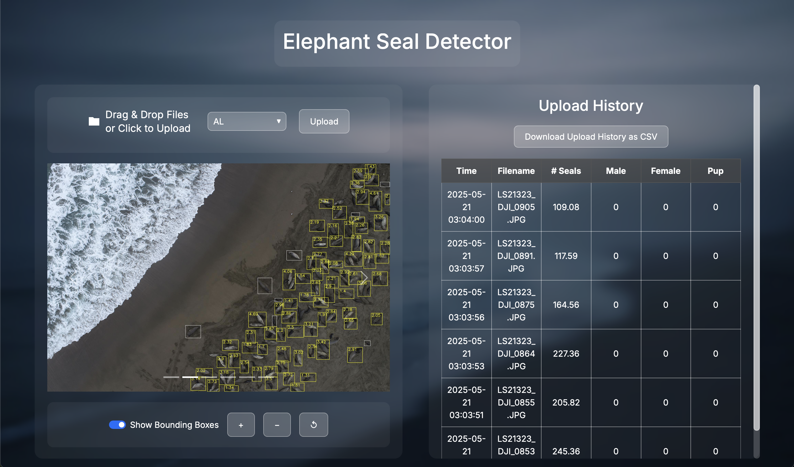

# Elephant Seals Image Detection Web App

<p align="center">
    
</p>

## Overview

This web application is designed to detect elephant seals in images using machine learning models. The app provides a user-friendly interface for uploading images and visualizing detection results.

## Features

- Image upload functionality
- Drone image elephant seal detection
- Visualization of detection results (future feature)
- User-friendly interface

## Deployment

- Currently deployed on Free Tier of Render:
  - [Elephant Seals Detection App](https://elephant-seals-detection.onrender.com)

  ## CLI Tool

Check our our CLI tool for model building and evaluation:
- [Elephant Seals CLI Tool](https://github.com/brandonhjkim/elephant-seals-CLI)

## Technologies Used

- Frontend: HTML, CSS, JavaScript
- Backend: Python (Flask/Django)
- ML Framework: Roboflow, Scikit-learn
- Future Technologies:
    - Frontend: React.js
    - Containerization: Docker

## Installation

---

Upload API Key (personal key from roboflow)
1. create a .env file in repository
2. Add to the file `ROBOFLOW_API_KEY={YOUR API KEY HERE}`
3. Save the file

Initializing 

```bash
# Clone the repository
git clone https://github.com/yourusername/elephant-seals-detection.git

# Navigate to the project directory
cd path/to/this/repository

# Create a virtual environment
python -m venv .venv
.venv\Scripts\activate

# Enter src file
cd src

# Install dependencies
pip install -r requirements.txt

# Run the application
python app.py
```

When rerunning the code, make sure to do the following:

```bash
# Activate virtual environment 
.venv\Scripts\activate

# Enter src file
cd src

# Run the application
python app.py
```

## Usage

1. Start the application
2. Upload an image containing elephant seals
3. View the detection results

## Contributing

Contributions are welcome, however this project is currently not accepting pull requests. If you have suggestions or improvements, please open an issue.
